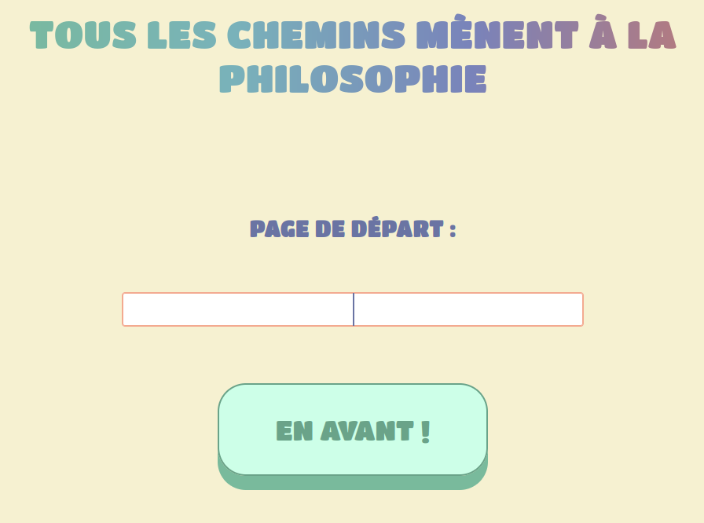

# WikiGame

## How do we play ?

The objective of this game is to explore the different Wikipedia links in order to reach the "Philosophie" page. The starting link is free although you are not allowed to start with the word "Philosophie" or words that redirect directly to its page like "Philosophique" or "Philosophe" for example.

  

PS: This game is designed to be used in French.

## How does it work ?

The operation is based on the interconnection of the different wikipedia pages. Indeed, many articles refer to other wikipedia pages in order to offer the reader the possibility to know more about a subject. These interconnections allow you to go from the "Cyclisme" page to the "Tour de France" page in one click. If we have fun pushing the thing we can, in several clicks, go from the "Chat" page to the "Philosophie" page (tested and approved) and that's exactly what we allow you to do here.
Also, it is important to specify that the application developed is based only on the internal interconnections to Wikipedia and omits the links to external pages. 

## And technically?

The game is developed from the Flask library which allows the backend interfacing of the application. It is here :
- retrieve the information provided by the user and the interaction events generated ;
- query the Wikipedia API to extract the interconnected pages of the selected page.

The application also relies on the use of the BeautifulSoup library used to scrape the content of wikipedia pages in order to extract related links.

The graphical interface is made from a html code stylized by a set of css classes.
